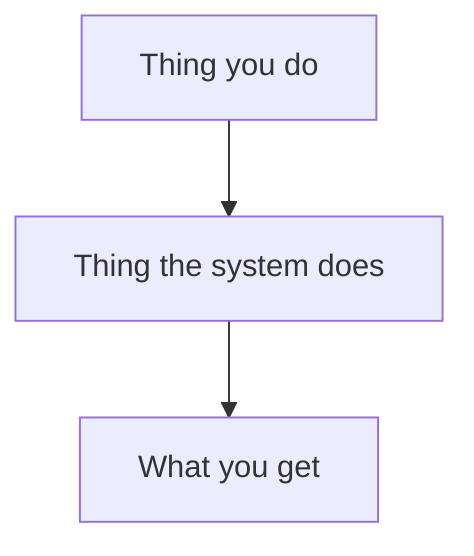

# Writing an internal doc

> Governed by **D72** (`planning/decisions/D72-write-repo-doc-is-the-internal-docs-standard.md`).
> How the corpus gets converted: **D73** (`…/D73-docs-upgrade-incrementally-through-close-out.md`).

## Who you are writing for

**Brandon plans this system and approves every decision. He did not write the code — agents did.**
He cannot skim a hundred files at agent speed to reconstruct what a word means.

So the reader is: **smart, invested, and missing the context the author has.** They know the goal.
They do not know your vocabulary, your file layout, or which of the three things you named is the
one they should type.

A second reader matters just as much: **a fresh agent session with no context.** Every inline link
you write is an edge it can follow instead of guessing. Under-linking costs it a search; a wrong
link costs it a false belief.

**He scans; he does not read paragraphs.** In his words (2026-09-15): *"Long paragraphs make all
these docs really hard to read and timely."* Fewer tokens is better for the agent reader too.

> **The whole standard in one line:** a good teacher would never write the doc you are about to
> write by default. Write the one they would.

---

## Quickstart

1. **Open with an at-a-glance list** — 3–6 bullets directly under the title, each linking down
   (`→ §2`). Never a paragraph. (Rule 1)
2. **Then a Quickstart** — the literal commands, in order, that get someone from nothing to a result.
3. **Open every `##` with 1–3 plain-English bullets** saying what the section holds and why it
   exists. (Rule 3)
4. **Link every command, script, schema and decision the first time you name it.**
5. **Explain or link every term** a newcomer would not know.
6. **Add a diagram** if the shape is not obvious.
7. **No prose block over two lines; table cells are keywords, not sentences.** (Rule 7)
8. **Run the checklist at the bottom**, then the gates.

---

## The seven rules

### 1. At a glance first, then the Quickstart

The first thing under the title is **a bullet list of what the reader must know right away**.

- 3–6 bullets, each one fact, ~15 words max.
- Cover: what this is, the key facts or numbers, what the reader does, what's broken or pending.
- Each bullet links to the section with the detail (`→ §4`).
- **Never a paragraph** — not even a two-sentence one.

```md
# Deploying the worker

- Deploys with one command: `scripts/release.sh` → §Quickstart
- Backs up the database first; takes ~2 min
- **Not safe mid-run** — drain workers first → §3
- Rollback: restore the backup → §5
```

Then **how to get started**:

- Real commands, copy-pasteable, in the order they are run.
- Say **where** each is typed — a Claude Code slash command and a shell command look identical on
  the page and are not interchangeable. `/begin-orchestration` goes in Claude Code. `python3 x.py`
  goes in a terminal. **Say which.**
- Then a short table of what must exist first, and what to do if it does not.

If the reader has to scroll past a paragraph to find a command, the doc has failed regardless of how
correct that paragraph is.

### 2. Name the runnable thing

**This rule exists because of a measured failure, since fixed.** `orchestration.md` once
documented only `./scripts/commander_drain.sh`. The reader had no idea `/orchestration-commander`
was a slash command he could type — and the script turned out to be a *wrapper* that reads that
very command file and feeds it to a Claude turn. The wrapper was also the dangerous path: no
dry-run, always writes to the shared lock directory.

**That doc now shows the fix**, which is why it is listed under Related below as an example to
imitate: `orchestration.md` § "The commander" is a two-row table giving both run paths — the
interactive slash command first, the unattended wrapper second, each with *when to use it* and the
note that they share one implementation. Read the before and the after together; the contrast is
the lesson.

So, for anything runnable:

- **List every way to run it**, in a table, with *when to use each*.
- Put the interactive/safe one first.
- If one path is destructive or has no dry-run, say so **at the command**, not in a later section.
- If two paths share an implementation, say that too — otherwise a reader assumes two things to
  keep in sync.

### 3. Plain English before detail — as bullets

Every `##` opens with **1–3 bullets** a newcomer can follow: what this section is, and what the
reader gets from it. Then the table, the flags, the policy.

| Instead of | Write |
|---|---|
| "Heavy-gate repos register a slot with `fleet_concurrency_check.py`." | - Some repos are expensive to test (browsers, Rust builds)<br>- Several at once buries the machine<br>- So each takes a **slot** first, like a parking space |
| "`base-template` always runs `--worktree`." | - A **worktree** = a second copy of the repo in another folder<br>- `base-template` always uses one: a lane there edits the files running it |

The detail is not the problem. The *missing first bullet* is.

### 4. Explain the vocabulary, or link where it is explained

Every term a newcomer would not know gets one of:

- a short definition **inline, at first use**, or
- a link to the vocabulary table or doc that defines it.

**Never both-and-neither** — a term used confidently and defined nowhere is the single most common
defect in these docs. If a repo has many such terms, build one vocabulary table (see
`base-template/docs/workflows/index.md`) and link every guide to it.

### 5. Link every named thing, inline, the first time

Naming a file the reader cannot reach is worse than not naming it: they cannot tell a live
reference from a stale one.

| Target | How to write it |
|---|---|
| A command in this repo | `[`/generate-roadmap`](../../.claude/commands/generate-roadmap.md)` |
| A script in this repo | `[`scripts/check_messages.py`](../../scripts/check_messages.py)` |
| A schema | `[`lane.schema.json`](../../.claude/workflows/lane.schema.json)` |
| A decision in this repo | `[D65](../../planning/decisions/D65-block-record-is-the-planning-unit.md)` |
| **Anything in another repo** | A **bare backticked path**, not a link — `` `agentic-portfolio/scripts/emit_state_write.sh` `` |

Three traps, all of which have fired here:

- **A relative link that climbs out of `planning/` breaks.** `planning/` is a symlink into the
  brain's vault, so `../..` leaves the *vault*, not the repo. See the `write-okf-markdown` skill.
- **Decision numbers collide across repos.** base-template's D43 is close-out integration; HQ's D43
  is the cross-domain priority graph. **Always say which repo** when citing a number.
- **Verify the target exists before you name it.** `scripts/emit_state_write.sh` was cited as local
  when it lives in HQ. One `ls` would have caught it, and the link gate would not — a bare path in
  backticks is not checked.

### 6. Give the reader the shape

If the system has moving parts, prose alone will not convey how they fit. Add a **mermaid diagram**
near the top, then **the same thing as a short numbered list underneath** — the diagram is for
orientation, the list is what a screen reader and a grepping agent get.

Then say plainly **which steps the reader personally does.** That single line is often the most
useful line in the document.



Diagrams render natively in this corpus. Keep them under ~12 nodes; past that, split the diagram.

### 7. Bullets and keywords, never paragraphs

- **No prose block longer than two lines.** Anything longer becomes bullets or a table.
- **Table cells are keywords and fragments**, not sentences: `sending, warmup, deliverability`, not
  "It keeps doing the sending and the warmup."
- **One fact per bullet.** A bullet joined by "and", "which" or "so" is two bullets.
- **Bold the thing being decided or warned about**, so scanning works.
- Cut every clause that only tells the reader that what follows is important.
- Cite an authority instead of restating it: "field table: `<file>`" beats reproducing the table and
  letting it drift.

---

## Structure that works

```
Title
- 3–6 at-a-glance bullets, each → §N   <- what this is, key facts, what to do, what's pending
## Quickstart                 <- the commands, and what must exist first
## <Overview / diagram>       <- 1–3 bullet opener, diagram, numbered list
## The <N> phases at a glance <- a table with links down into detail
## 1..N — the detail          <- each opening with 1–3 plain-English bullets
## Troubleshooting            <- symptom -> likely cause -> what to check
## See also                   <- every related doc, command and decision
```

Not every doc needs every section. Every doc needs the at-a-glance list, the Quickstart, and the bullet
openers.

---

## Before you commit

- [ ] The first thing under the title is 3–6 at-a-glance bullets linking to sections — no paragraph.
- [ ] A newcomer can run something correctly within the first screen.
- [ ] Every runnable thing lists **all** the ways to run it, and says where each is typed.
- [ ] The destructive path is labelled at the command, not later.
- [ ] Every `##` opens with 1–3 plain-English bullets before detail.
- [ ] No prose block runs past two lines; table cells are keywords, not sentences.
- [ ] Every unfamiliar term is defined inline or linked.
- [ ] Every command / script / schema / decision is linked on first mention.
- [ ] Cross-repo references are **bare qualified paths**, never relative links.
- [ ] Every named file was verified to exist (`ls` it — the gate will not catch a backticked path).
- [ ] Decision numbers say which repo.
- [ ] A diagram exists if the shape is non-obvious, with the same content as a numbered list beneath.
- [ ] OKF frontmatter is present and `keywords` has **3–7** entries — see `write-okf-markdown`.
- [ ] `bastion validate-brain --links`, `--structure` and `--graph` all clean, **one flag per run**.

## The check the gates cannot do

**No gate can tell whether a doc teaches.** `validate-brain` checks that links resolve and
frontmatter parses. It is silent on every rule above.

The substitute is a **fresh reader**: hand the doc to an agent with no context on this system and
ask it to perform the task the doc describes, reporting every point where it had to guess. What it
guessed at is the defect list. Do this for any doc someone will rely on without you in the room.

## Related

- `write-okf-markdown` — frontmatter, `index.md` rows, and the `planning/` symlink link trap.
- `write-operating-doc` — a doc read to act today; same at-a-glance and no-paragraph rules, one screen.
- `base-template/docs/workflows/index.md` — a worked example: diagram, vocabulary table, and
  jump-links from every term.
- `base-template/docs/workflows/orchestration.md` and `lane-coordination.md` — worked examples of
  the quickstart-first, plain-English-opener shape. `orchestration.md` § "The commander" is also
  the *after* half of rule 2's measured failure: the defect described there was fixed in this file,
  and its two-row run table is the shape rule 2 asks for.
- `base-template/docs/workflows/roadmap-sweep.md` — a worked example of rule 2's danger labelling:
  the safe `--dry-run` path is shown first and the live side effects are called out at the command.
- For **published** writing (blog posts, learning modules), the fuller voice standard is
  `learn-ai/content/blog/CLAUDE.md` § "Voice and tone" — same teacher identity, higher bar. Its
  long-sentence rhythm applies to published prose only, never to these docs.
