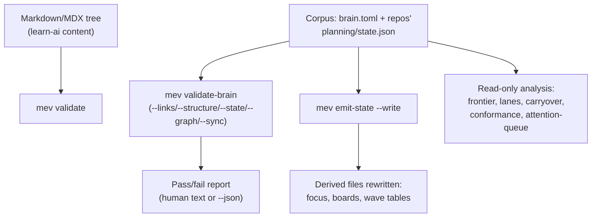

# mev

A Rust CLI that validates a tree of Markdown/MDX files and a JSON-graph "corpus" of planning
state — and that can also *write* corrected, derived, or newly-generated files back into that
tree when you ask it to.

It grew out of two real use cases:

- **Content validation** for a Next.js site (learn-agentic-ai.com): frontmatter shape, JSON
  structs, dead links, untagged code fences.
- **A "brain" corpus**: a folder tree of Markdown files that together describe a body of work —
  decisions, statuses, per-project plans — each carrying a small YAML header (its *OKF
  frontmatter*, described below) and a `planning/state.json` file per project describing blocks
  of work and how they depend on each other. `mev` checks that this all stays internally
  consistent, and derives read-only summaries (dashboards, dependency graphs, "what's next")
  from it.

Everything here operates on plain files on disk — no server, no database.

## What this is for

Use `mev` when you have either:

1. A tree of Markdown/MDX content you want to lint (frontmatter present and well-formed, no dead
   local links, no untagged code fences) — see [`validate`](#validate---blog---lint-path).
2. A **corpus**: one or more repos, each with a `brain.toml` config file at its root and a
   `planning/state.json` describing units of work ("blocks") and their dependencies. `mev` can
   validate that corpus's structural integrity, and derive read-only views over it — see
   [`validate-brain`](#validate-brain-path---sync--graph--state--links--structure) and the
   reference table below.

**Vocabulary**, since none of it is obvious from the name:

| Term | Meaning |
|---|---|
| **Corpus** | The full set of Markdown/JSON files `mev` treats as one connected body of work, rooted at `brain.toml`. |
| **`brain.toml`** | The config file that tells `mev` where a corpus's repos live and what its frontmatter vocabulary is. Schema: [`docs/brain-toml.md`](docs/brain-toml.md). |
| **OKF frontmatter** | The small YAML header (`type`, `title`, `description`, …) every corpus Markdown file carries. Schema: [`docs/okf-schema.md`](docs/okf-schema.md). |
| **`state.json`** | Per-repo JSON file listing units of work ("blocks"), their status, and `depends_on` edges to other blocks, approvals, or a human ("operator gates"). |
| **Block** | One unit of work tracked in a `state.json`, identified by a `repo:id` key (e.g. `mev:MV.10.A`). |
| **Carryover** | An entry in `state.json` recording something not yet resolved (a defect, deferred work, drift, or an environment issue) — see `mev carryover` below. |

## Quickstart

```bash
# 1. Clone this repo AND its path-dependency sibling, side by side
git clone https://github.com/bredmond1019/mev
git clone https://github.com/bredmond1019/okf-core
cd mev

# 2. Build (release binary lands at target/release/mev)
cargo build --release

# 3a. Validate a plain Markdown/MDX content tree (no corpus needed)
./target/release/mev validate /path/to/some/content/tree

# 3b. Or validate a corpus that has a brain.toml at its root
./target/release/mev validate-brain /path/to/your/corpus

# Machine-readable output for either — exit code is unchanged (1 on any error)
./target/release/mev --json validate-brain /path/to/your/corpus
```

### Prerequisites

| Needed | Why |
|---|---|
| A Rust toolchain supporting **edition 2024** (Rust 1.85 or newer — check with `rustc --version`) | Toolchain to build; all other dependencies fetch on first build. |
| [`okf-core`](https://github.com/bredmond1019/okf-core) cloned as a sibling directory (`../okf-core`) | `mev`'s `Cargo.toml` depends on it via a relative path — it will not build standalone otherwise. |
| A content tree, for `validate` | Any directory of `.md`/`.mdx`/`.json` files. |
| A corpus with `brain.toml` at its root, for `validate-brain` and everything below it | See [`docs/brain-toml.md`](docs/brain-toml.md) for the schema if you're setting one up from scratch. |

## How it fits together



1. Point `mev validate` at a content tree, or `mev validate-brain` at a corpus root.
2. Validation only ever reads files and reports; it never writes anything.
3. Separately, `mev emit-state --write` (and the other `--write`-flagged commands below)
   regenerate derived files — dashboards, per-repo rollups, wave tables — from the same corpus.
4. A family of read-only commands (`frontier`, `lanes`, `carryover`, `conformance`,
   `attention-queue`, …) report on corpus state without touching anything.

## Subcommand reference

All subcommands accept a **global `--json` flag** (before the subcommand) to emit a
machine-readable envelope instead of human text; exit codes are unchanged either way. Every
subcommand also accepts a positional or `--path`-style argument to locate `brain.toml` by walking
up from a directory (defaults to `.`) — omitted below for brevity except where a command's
argument shape differs.

**Writing/destructive commands are marked in the Write? column.** "Dry-run default" means the
command only prints its plan unless you pass `--write`; "Always writes" means there is no
dry-run mode at all.

| Command | What it does | Write? |
|---|---|---|
| [`validate`](#validate---blog---lint-path) | Lints a plain Markdown/MDX content tree (frontmatter, JSON structs, dead links, code fences). | Read-only |
| [`validate-brain`](#validate-brain-path---sync--graph--state--links--structure) | Validates a corpus: OKF frontmatter by default, or one deeper check via a flag. | Read-only |
| `validate-state <path>` | Validates one `state.json` file in isolation (no sibling-repo checks). | Read-only |
| `manifest [path]` | Emits a JSON manifest of every corpus file (feeds a RAG indexer). | Read-only |
| [`emit-state [path]`](#emit-state-path---write---scope-repo---require-fresh) | Regenerates derived views (per-repo `focus`, HQ rollups, wave tables) from `state.json`. | **Dry-run default** — `--write` applies |
| `state-history <path> [--restore SEQ]` | Lists (or restores) a file's revision history recorded by `emit-state`'s writer. | Restore writes; listing is read-only |
| `emit-graph [path]` | Emits the `doc_id` knowledge graph as JSON. | Read-only |
| `emit-block-graph [path]` | Emits the corpus-wide block-dependency graph as JSON, scoped by `--scope hq\|tier\|repo\|epic`. | Read-only |
| `generate-graph [path] [--out DIR]` | Writes an interactive HTML visualization of the knowledge graph. | **Always writes** (no dry-run) |
| `defer-epic <slug> [path]` | Pauses an epic and defers its open blocks. | **Dry-run default** — `--write` applies |
| `resume-epic <slug> [path]` | Un-pauses an epic (inverse of `defer-epic`). | **Dry-run default** — `--write` applies |
| `complete-epic <slug> [path]` | Marks an epic `complete` in the registry (does not touch member blocks). | **Dry-run default** — `--write` applies |
| `sync-epics [path]` | Reconciles every epic's registry status against its blocks' statuses. | **Dry-run default** — `--write` applies |
| `set-block-status <repo:id> <status> [path]` | Sets one block's authored status (`open`/`in_progress`/`deferred`/`closed`). | **Dry-run default** — `--write` applies |
| `close-operator-gate <slug> [path] --exit-verified` | Removes every `operator`-type dependency edge carrying `slug`, fleet-wide. | **Writes** — refuses without `--exit-verified` (no silent dry-run) |
| `normalize-op-slugs [path]` | Renames stuttering operator/approval slugs fleet-wide (e.g. `operator-foo` → `foo`). | **Dry-run default** — `--write` applies |
| `approve <slug> --digest <d> [path]` | Clears a pending approval gate whose stored digest matches. | **Writes** (no dry-run) |
| `reject <slug> [path]` | Clears a pending approval gate unconditionally. | **Writes** (no dry-run) |
| `attention-queue [path] [--out FILE] [--notify-only]` | Emits every stale/aging item across the corpus as an ordered JSON queue. | Read-only |
| `doc materialize --model <m> --input <f> [path]` | Plans/builds a document from a JSON payload (opportunity, learning-artifact, proposal). | **Dry-run default** — `--write` applies |
| `doc opportunity ingest\|set-stage\|add-action\|merge-contacts` | Creates/updates an "Opportunity" tracking document. | **Dry-run default** — `--write` applies |
| [`carryover [path]`](#carryover-path) | Sweeps every `carryover[]` entry; reports cleared/actionable/not-evaluable, with clustering and audit modes. | Read-only, except `--dispose`/`--backfill` write |
| `graph-findings [path]` | Scans the corpus for mechanically-detectable findings (orphaned lane blocks, dead referenced paths). | Read-only — `--write` appends findings |
| `conformance [path] [--check NAME]` | Runs registered drift checks (facts duplicated in two places that should agree). | Read-only |
| `check-consumers [path] [--consumer NAME]` | Compiles downstream consumers' test targets against this working tree of `mev`. | Read-only (compiles code, writes no source) |
| `frontier [path]` | Prints every startable/blocked lane segment corpus-wide. | Read-only |
| `lanes [path]` | Prints six-state lane-segment availability + unblock leverage. | Read-only |

Full flag-by-flag detail, diagnostic codes, and exit codes for every command above:
[`docs/cli.md`](docs/cli.md).

## Detail on the two most common commands

### `validate [--blog] [--lint] [path]`

Lints a Markdown/MDX content tree — the case with no `brain.toml` corpus involved at all.

```bash
mev validate                       # defaults to ../learn-ai/content/learn
mev validate ~/some/content/tree   # explicit path
mev validate --lint                # + dead-link / untagged-code-fence checks
mev validate --blog                # validates a blog tree instead (frontmatter + pt-BR parity + lint)
```

Read-only. Exits 1 if any error-severity diagnostic is found. Full diagnostic table:
[`docs/cli.md`](docs/cli.md#validate---blog---lint-path).

### `validate-brain [path] [--sync|--graph|--state|--links|--structure]`

Validates a corpus rooted at `brain.toml`. With no flags, it checks OKF frontmatter only.

```bash
mev validate-brain ~/Dev/your-corpus              # base OKF frontmatter check
mev validate-brain ~/Dev/your-corpus --links      # + dead markdown/file/wikilink references
mev validate-brain ~/Dev/your-corpus --structure  # + index.md <-> directory coverage
mev validate-brain ~/Dev/your-corpus --state      # + state.json schema + block-dependency graph
mev validate-brain ~/Dev/your-corpus --graph      # + doc_id knowledge-graph integrity
mev validate-brain ~/Dev/your-corpus --sync       # + cross-repo synced_from watermark check
```

**These five flags do not compose.** Dispatch is a first-match `if`/`else if` chain in source
(`src/main.rs`), checked in this exact order: `--links` > `--structure` > `--state` > `--graph` >
`--sync`. Passing more than one silently runs only the highest-precedence one — always invoke
one flag per run. Read-only in every mode. Exits 1 on any error-severity diagnostic.

### `emit-state [path] [--write] [--scope REPO] [--require-fresh]`

Regenerates every corpus file *derived from* `state.json` — a per-repo `focus` summary, the
top-level rollup, and any `master-plan.md` wave table between its generated-content markers.

```bash
mev emit-state ~/Dev/your-corpus              # dry-run: prints the plan, writes nothing
mev emit-state ~/Dev/your-corpus --write      # applies it
mev emit-state ~/Dev/your-corpus --write --scope your-repo   # only regenerate one repo's files
```

**`--write` is destructive to the derived files it targets** (it overwrites them in place,
though every overwrite is recorded — see `state-history` above, which can restore a prior
version). There is no flag needed to preview: omitting `--write` always dry-runs.

### `carryover [path]`

Sweeps every repo's `carryover[]` entries and sorts them into three lanes: `cleared` (safe to
delete), `actionable` (something named is still unmet), `not-evaluable` (no machine-checkable
predicate). Also supports `--audit` (fleet census), `--trajectory` (weekly outflow), and
`--would-block` (blast-radius preview) — all read-only.

```bash
mev carryover ~/Dev/your-corpus                  # the sweep, human-readable
mev carryover ~/Dev/your-corpus --json           # machine-readable
mev carryover ~/Dev/your-corpus --dispose        # MOVES cleared entries to an archive file — writes
mev carryover ~/Dev/your-corpus --dispose --dry-run   # preview exactly what --dispose would do
```

`--dispose` and `--backfill` are the only writing modes in this command family; every other flag
(including `--audit`, `--trajectory`, `--would-block`) is read-only.

## `--json` output shape

Every validating command's `--json` flag emits a `JsonReport` envelope:

```json
{
  "validator": "brain",
  "root": "/path/to/repo",
  "errors": 0,
  "warnings": 1,
  "diagnostics": [
    {
      "severity": "warning",
      "file": "docs/foo.md",
      "locator": "keywords",
      "message": "keywords count 2 is below the recommended minimum of 3"
    }
  ]
}
```

Full field reference: [`docs/cli.md`](docs/cli.md).

## Tests

```bash
cargo nextest run --lib --bins    # fast — use this over plain `cargo test`
cargo test                        # full unit + integration suite; authoritative gate
cargo fmt --check && cargo clippy -- -D warnings
```

`cargo-nextest` (`brew install cargo-nextest`) runs each of this repo's ~25 integration-test
binaries as a parallel process instead of serially, which is much faster during iteration.

## Directory map

```
mev/
├── src/
│   ├── main.rs       ← clap CLI entry point; every subcommand's flags are defined here
│   ├── lib.rs         ← crate root: Diagnostic/Report core + public API re-exports
│   ├── validator.rs   ← ContentValidator trait (crawl + validate_item + run driver)
│   ├── shared.rs      ← shared helpers (frontmatter extraction, kebab-case checks, ...)
│   ├── theme.rs       ← terminal color/theme handling
│   ├── learn_ai/      ← content-tree validator: frontmatter, blog, lint, voice checks
│   ├── brain/         ← corpus validator + derived-view generators (state, graph, carryover, ...)
│   ├── doc/           ← document materializer + Opportunity-record mutators
│   └── consumers/     ← discovery for the check-consumers compile gate
└── tests/             ← integration tests + fixtures
```

Full module-by-module breakdown: [`docs/architecture.md`](docs/architecture.md).

## Documentation

| Doc | Contents |
|---|---|
| [`docs/cli.md`](docs/cli.md) | Full CLI reference: every subcommand, flag, diagnostic code, exit code, example |
| [`docs/architecture.md`](docs/architecture.md) | Module map, `ContentValidator` trait, core types |
| [`docs/brain-toml.md`](docs/brain-toml.md) | `brain.toml` config schema |
| [`docs/okf-schema.md`](docs/okf-schema.md) | OKF frontmatter fields, validation rules, diagnostic table |
| [`docs/carryover-contract.md`](docs/carryover-contract.md) | The `rank_carryover` ranking API and wire shape downstream consumers read |
| [`docs/workflows/index.md`](docs/workflows/index.md) | The Claude Code SDLC pipeline commands used to develop this repo |

## Troubleshooting

| Symptom | Likely cause | What to check |
|---|---|---|
| Build fails looking for `okf-core` | The path dependency sibling isn't cloned. | Clone `https://github.com/bredmond1019/okf-core` next to this repo (`../okf-core` relative to `mev/`). |
| `validate-brain --links --state` (or any two flags together) only checks one thing | The flags don't compose — see the dispatch order above. | Run one flag per invocation. |
| `emit-state --write` reports `E_EMIT_LOCK_HELD` | Another live `mev` write process holds the advisory lock. | Wait for it to finish; a lock from a dead process is reclaimed automatically. |
| A `--write` command refuses inside a git worktree | Writers resolve paths from `brain.toml`, not the current working directory, so writing from a linked worktree would target the wrong checkout. | Run from the main working tree. |
| A generated file looks wrong after `emit-state --write` | The write is recorded, so it's recoverable. | `mev state-history <path>` to list revisions, `--restore SEQ` to roll back. |

## License

Licensed under either of

- Apache License, Version 2.0 ([LICENSE-APACHE](./LICENSE-APACHE) · <http://www.apache.org/licenses/LICENSE-2.0>)
- MIT license ([LICENSE-MIT](./LICENSE-MIT) · <http://opensource.org/licenses/MIT>)

at your option. Unless you explicitly state otherwise, any contribution intentionally submitted
for inclusion in this work by you, as defined in the Apache-2.0 license, shall be dual licensed
as above, without any additional terms or conditions.

Built for one operator and released because it may be useful to others — there is no support
obligation, no issue-response SLA, and no stability promise.
